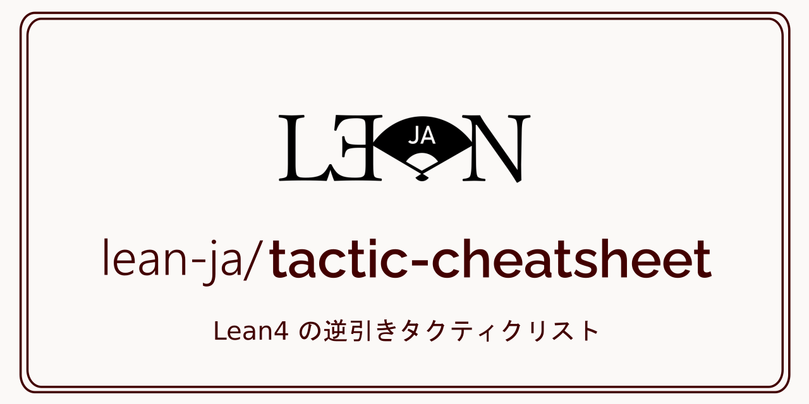

# README

[]()

[](https://github.com/lean-ja/lean-by-example/blob/main/.github/workflows/ci.yml) [](https://github.com/lean-ja/lean-by-example/blob/main/.github/workflows/deploy.yml) [](https://github.com/lean-ja/lean-by-example/blob/main/.github/workflows/update.yml) [](https://github.com/lean-ja/lean-by-example/blob/main/.github/workflows/devcontainer.yml) [](https://discord.gg/p32ZfnVawh)

プログラミング言語であるとともに定理証明支援系でもある Lean 言語と、その主要なライブラリの使い方を豊富なコード例とともに解説した資料です。

> [!WARNING]
> 本書は現在開発中であり、各ページのURLが予告なく変更され、リダイレクトも設定されないということがあり得ます。リンク切れを避けるには、個別ページではなくトップページにリンクを張るようにしてください。

## CONTRIBUTING

誤りの指摘、編集の提案や寄稿を歓迎いたします。この GitHubリポジトリに issue や Pull Request を開いてください。開発環境が構築済みの Codespace を使用することができます。

[](https://codespaces.new/lean-ja/lean-by-example)

[CONTRIBUTING](./.github/CONTRIBUTING.md)に開発者向けの情報をまとめてあるので、そちらをご確認ください。

## Do you want to translate this book?

Thank you for your interest in translating this book! 😄 But please note that we are currently **not accepting translations** of this book because this book is still under development! No content is stable yet.

## Citation

If you use this book for your work, please cite it as follows:

```bibtex
@misc{leanbyexample,
  title = {Lean by {E}xample},
  url = {https://lean-ja.github.io/lean-by-example/}
  author = {The lean-ja community},
  note = {Accessed on Month Day, Year},
}
```

As this book is a website, the content changes on a daily basis. A PDF version is generated for each commit by the [Generate PDF workflow](./.github/workflows/pdf.yml). Use this as a citation if necessary.

## スポンサー

このプロジェクトは [Proxima Technology](https://proxima-ai-tech.com/) 様よりご支援を頂いています。


Proxima Technology（プロキシマテクノロジー）は数学の社会実装を目指し、その⼀環としてモデル予測制御の民主化を掲げているAIスタートアップ企業です。数理科学の力で社会を変えることを企業の使命としています。
