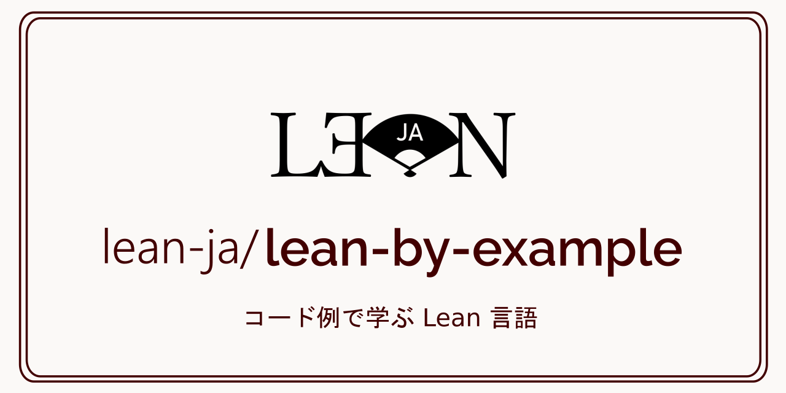

# README

[]()

プログラミング言語であるとともに定理証明支援系でもある Lean 言語と、その主要なライブラリの使い方を豊富なコード例とともに解説した資料です。

> [!WARNING]
> 本書は現在開発中であり、各ページのURLが予告なく変更され、リダイレクトも設定されないということがあり得ます。

## CONTRIBUTING

誤りのご指摘を歓迎いたします。この GitHub リポジトリに issue を開いてください。Pull Request は誤りの修正に関するもののみ歓迎しており、それ以外の Pull Request は受け付けておりません。

## Do you want to translate this book?

Thank you for your interest in translating this book! 😄 But please note that we are currently **not accepting translations** of this book because this book is still under development! No content is stable yet.

## Citation

If you use this book for your work, please cite it as follows:

```bibtex
@misc{leanbyexample,
  title = {Lean by {E}xample},
  url = {https://lean-ja.github.io/lean-by-example/},
  author = {Asei Inoue},
  note = {Accessed on Month Day, Year},
}
```

## License

この文書は[CC BY-NC-SA 4.0 ライセンス](https://creativecommons.org/licenses/by-nc-sa/4.0/deed.ja)の下で公開されています。

## プライバシーポリシー

当 Web サイトでは、ユーザーのアクセス状況の分析のために Google アナリティクスを使用しています。Google アナリティクスは、 Cookie を利用してユーザーのWebサイト利用情報を収集しますが、これは匿名化されており、個人を特定する情報は収集されません。
当サイトでの Google アナリティクスの利用に関する詳細については、以下の Google の公式ページでご確認いただけます。

* [Google アナリティクス利用規約](https://www.google.com/analytics/terms/)

## 謝辞

このリポジトリのSNSカードおよび、lean-jaのロゴを作成してくださった [@aconite](https://github.com/aconite-ac) さんに感謝いたします。

## スポンサー

このプロジェクトは [Proxima Technology](https://proxima-ai-tech.com/) 様よりご支援を頂いています。


Proxima Technology（プロキシマテクノロジー）は数学の社会実装を目指し、その⼀環としてモデル予測制御の民主化を掲げているAIスタートアップ企業です。数理科学の力で社会を変えることを企業の使命としています。
